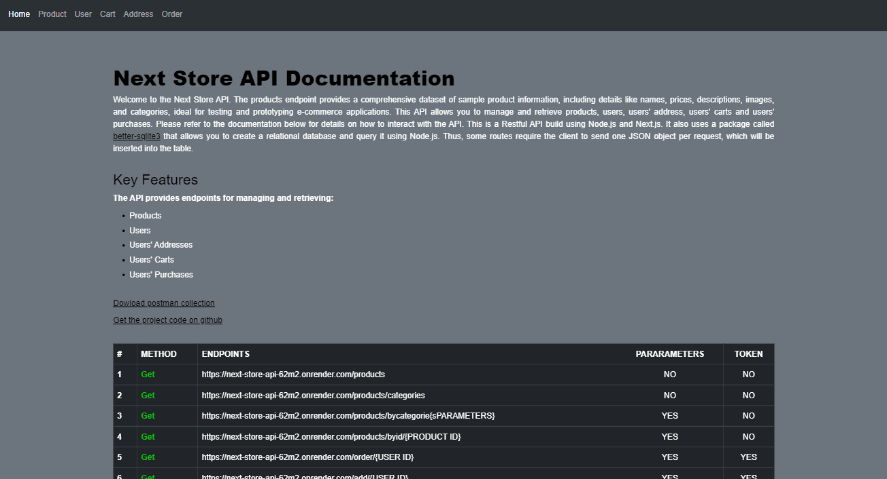
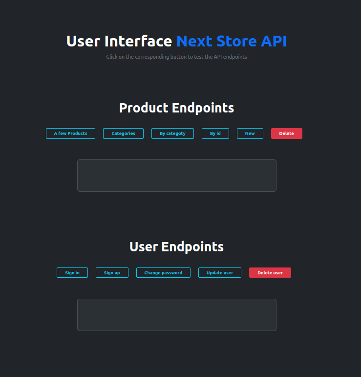

# Thiago's Front-End Developer Portfolio

 

Welcome to my portfolio repository! Here, you'll find information about me, my projects, and the technologies I work with. My goal is to showcase my skills and demonstrate my passion for front-end development.

## Table of Contents
- [About Me](#about-me)
- [Projects](#projects)
- [Skills and Tools](#skills-and-tools)
- [How to View](#how-to-view)
- [Contact Information](#contact-information)

## About Me
Hi! I'm Thiago, a front-end developer passionate about crafting engaging user
 experiences. With a strong focus on React and modern JavaScript frameworks, I 
 strive to build web applications that are not only functional but also visually appealing and responsive. My current goal is to contribute to innovative teams and continue honing my skills in front-end development.

## Projects

### 1. E-Commerce Application
- **Description**: A fully functional e-commerce platform with features like pagination, shopping cart, and product filtering.
- **Technologies Used**: Next JS, Redux toolkit, Framer motion, seContext API, Keen-slider.
- **Role**: Front-end developer.
- **Highlights**: Implemented efficient pagination, responsive design, user-friendly interface, local storage integration .

  - Repository - [Next Store](https://github.com/ThiagoAndo/Store-e-commerce.git)
  - Live Website - [Vercel](https://store-comerce.vercel.app/)
  
 

### 2. Connected World Explorer
- **Description**: A project designed to visualize global connections through an interactive interface.

- **Technologies Used**: ReactJS, Mui material, Redux toolkit, Framer motion, Leaflet
React router dom, Mobiletfirst workflow, useContext API, React Bootstrap.
- **Role**: Front-end developer.
- **APIs**: REST Countries, TimeZoneDB, Geoapify, OpenWeather ,GeoHive-( Population by Sex and Marital Status, Electoral Division, Census 2016, Theme 1.2, Ireland, 2016, CSO & Tailte Éireann )
.
- **Highlights**: Delivered a highly interactive and visually engaging data visualization tool.
  - Repository - [Connected World Explorer](https://github.com/ThiagoAndo/Connected-World-Explorer.git)
  - Live Website - [Netlify](https://store-comerce.vercel.app/)
  
 

### 3. Next Store Backend API
- **Description**: A RESTful API designed for students building front-end applications.
- **Technologies Used**: Node.js, Express JS, Jsonwebtoken, Nodemailer, Body-parser, Bcryptjs, Bootstrap.
- **Role**: API developer.
- **Highlights**: Provides robust and scalable endpoints for user management and product handling.
  - Repository - [Next Store API](https://github.com/ThiagoAndo/Next-store-API.git)
  - Live Website - [Documentation](https://next-store-api-62m2.onrender.com/doc)
  - Live Website - [Build-in UI](https://next-store-api-62m2.onrender.com/userInterface)
  
 

  Fig. 01- API documentation.
   
   
  
 

  Fig. 02- Build-in UI.

## Skills and Tools
- **Languages**: JavaScript, HTML, CSS.
- **Libraries & Frameworks**: React, Redux, Node.js, Express, TailwindCSS.
- **Tools**: Git, GitHub, VSCode, Figma, Postman.
- **Other**: REST APIs, Responsive Design.

## How to View
- **Live Portfolio Website**: [Insert Link Here]
- **GitHub Repositories**: [Insert Link Here]

## Contact Information
- **Email**: [Insert Email Here]
- **LinkedIn**: [Insert LinkedIn Profile Here]
- **GitHub**: [Insert GitHub Profile Here]

